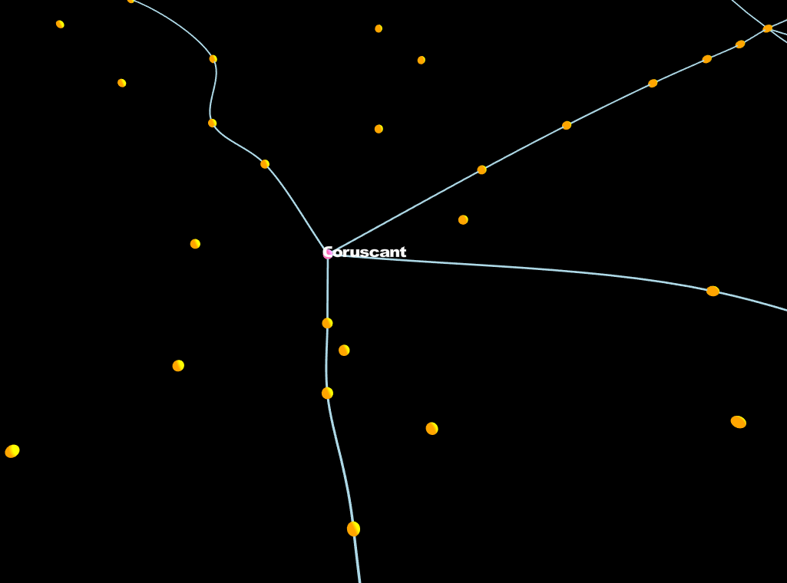

# StarWarsMap

This is the repo where we build a map of the Star Wars Galaxy using graphs

In the first steps of the project we are foccusing on designing a graph structure that connects all available planets in the galaxy. Taking into account known hyperspace routes, grids and sectors.

We are using this [map](http://www.swgalaxymap.com/search/) for reference.

After we complete the graph generation process we can store this data on neo4j with the same structure.

There is also a web app. Where also you will be able to plot a route between two planets and traverse the galaxy far far away.

## Avilable data used for this map

The information for this map is contained on this json files:

- map_api/data/grid_db.json
- map_api/data/hyperlanes_db.json
- map_api/data/regions_db.json

You can also find a csv file taken from [This Dataset](https://hbernberg.carto.com/tables/planets/public) which belongs to the author of the map mentioned above.
To generate the json files you can also use the script provided in /app/migrations/json_from_csv.py

## To Run the current version of the map

You need to install [Python 3.7.X](https://www.python.org/downloads/)

Install virtualenv if you prefer: `pip install virtualenv`

Create a new virtualenv with `virtualenv venv`

Activate the virtualenv with `/venv/Scripts/activate` in Windows or `source /venv/bin/activate` on unix based systems

Install the requierements with `pip install -r requirements.txt`

Inside the map_api folder run the plot with `python manage.py plotgraph`

A figure will be displayed showing the current state of the map.

## To Run the map api

Follow the same steps as before and use the command `python manage.py run`

## Run the web app

This project uses yarn and nodejs.

In the project folder run `yarn install` to install the required packages, and `yarn start` to run the app in developement mode.

## Some snapshots of the project

### Hover to see the planets name

### Explore the galaxy

### Click on two planets to get the path between them

